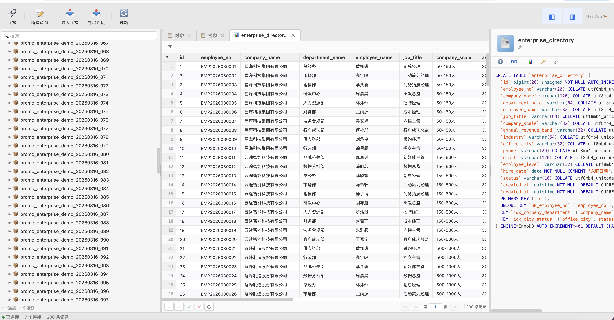

# 🐕 NaviDog

一个轻量级的 Web 端 MySQL 管理工具，风格类似 Navicat。开箱即用，本地启动，适合日常查库、改表、导入导出和临时数据处理。

## 界面预览



## 功能

- 🔗 **连接管理** — 保存多个 MySQL 连接，支持 SSH 隧道、连接测试、快速重连
- 📥 **NCX 导入/导出** — 浏览器端直接解析 Navicat 连接文件，支持密码解密与重新导出
- 📝 **SQL 编辑器** — 语法高亮、Schema 自动补全、SQL 格式化、运行当前语句或选中片段、多结果集展示、运行中止
- 📊 **数据浏览与编辑** — 分页、筛选、排序、列宽拖拽、行选择、复制为 INSERT / UPDATE / TSV，支持表格内增删改后批量提交
- 🧱 **表结构设计** — 可视化新建表 / 修改表，实时 SQL 预览，查看 DDL、列、索引、外键信息
- 🔑 **索引与外键管理** — 在对象信息面板中直接新增 / 删除索引和外键
- 📥 **导入向导** — 支持 CSV、TXT、Excel、JSON、SQL，提供数据预览、字段映射、自动建表，并支持 `append` / `replace` / `upsert`
- 📤 **导出向导** — 支持 CSV、TXT、XLSX、JSON、SQL，自定义表、列和导出选项，适合大表分批导出
- 📋 **表级操作** — 复制表（仅结构 / 结构+数据）、删除表、清空表、查看对象列表、运行 SQL 文件
- 💾 **转储能力** — 支持单表或整库导出结构 / 结构+数据为 SQL 文件
- 🖥️ **布局体验** — 左右面板可折叠、可拖拽调整大小，适合宽屏和小屏切换

## 快速开始

### 方式一：npx 直接用（推荐，无需安装）

```bash
npx navidog
```

运行后终端会显示：

```
  🐕 NaviDog starting on http://127.0.0.1:3001

NaviDog listening on http://127.0.0.1:3001
```

1. 打开浏览器访问 **http://127.0.0.1:3001**
2. 点击工具栏「连接」创建 MySQL 连接
3. 用完后在终端按 `Ctrl + C` 停止服务

自定义端口：`PORT=8080 npx navidog`

### 方式二：全局安装

```bash
npm install -g navidog
navidog
```

以后随时在终端输入 `navidog` 即可启动，`Ctrl + C` 停止。

### 方式三：克隆源码

```bash
git clone https://github.com/fhyfhy17/navidog.git
cd navidog
npm install
npm run build
npm start
```

启动后打开 **http://127.0.0.1:3001** 即可使用。

### 开发模式

```bash
npm install
npm run dev
```

前端页面：http://localhost:5173 （自动代理 API 到后端 3001 端口）

### 自定义端口

```bash
PORT=8080 npm start
# 或
PORT=8080 navidog
```

## 使用方式

1. 打开浏览器访问 `http://127.0.0.1:3001`
2. 点击工具栏「连接」创建 MySQL 连接，或用「导入连接」导入 Navicat 的 `.ncx` 文件
3. 填写主机、端口、用户名、密码，按需开启 SSH 隧道
4. 连接后在左侧树浏览数据库和表，双击表名查看数据
5. 右键数据库或表可打开导入向导、导出向导、复制表、转储 SQL、查看 DDL、修改表结构
6. 点击「新建查询」打开 SQL 编辑器，运行当前语句或选中的 SQL
7. 在右侧对象信息面板中查看 DDL、列、索引、外键信息，并直接做结构管理

## 安全说明

- 服务默认绑定 `127.0.0.1`，仅本机可访问
- 连接密码存储在浏览器 localStorage 中
- 不建议将服务暴露到公网

## 技术栈

- **前端**: React 19 + TypeScript + Vite + CodeMirror 6
- **后端**: Express 5 + mysql2 + ssh2
- **数据导入导出**: Papa Parse + xlsx + File System Access API
- **部署**: 单进程同时服务 API 和前端静态文件（无需 nginx）

## License

MIT
